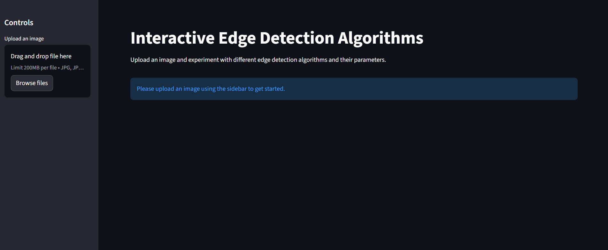
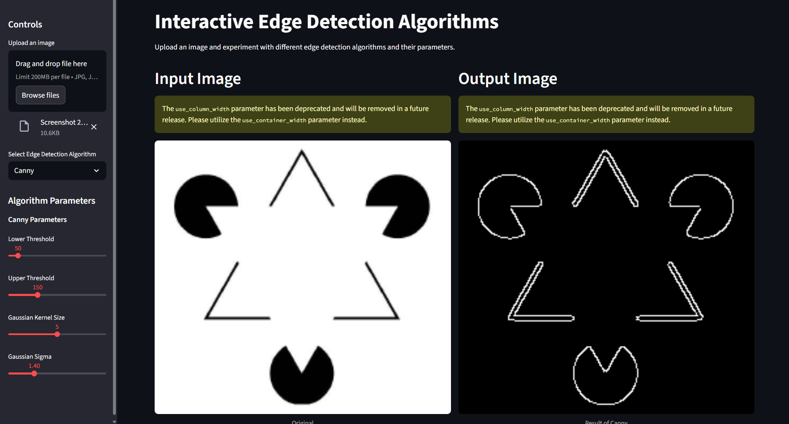
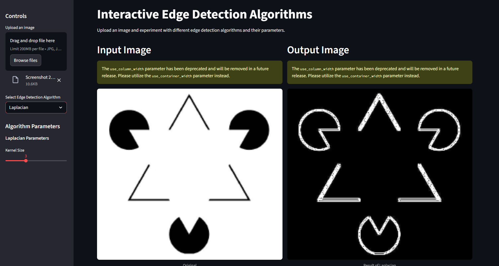
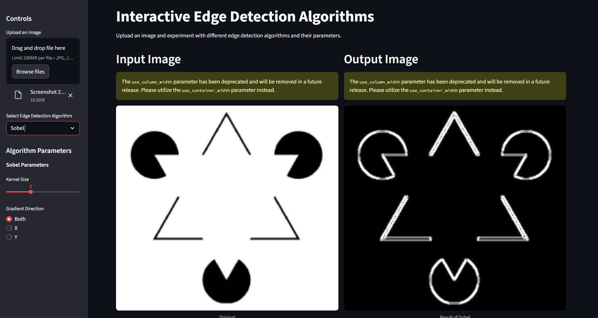

# Interactive Edge Detection Application

This project is a user-friendly web application built with Python, Streamlit, and OpenCV that allows for visual experimentation with different edge detection algorithms. Users can upload an image and dynamically adjust algorithm parameters to see the results in real-time.

## Application Interface & Output

Here is a screenshot of the application's user interface, showing the input/output displays and the control panel in the sidebar.



### Example: Canny Edge Detection

Below is an example showing the Canny algorithm applied to an image, with its parameters adjusted via the sidebar controls.



### Example: Laplacian Edge Detection

Below is an example showing the Laplacian algorithm applied to an image, with its parameters adjusted via the sidebar controls.



### Example: Sobel Edge Detection

Below is an example showing the Sobel algorithm applied to an image, with its parameters adjusted via the sidebar controls.



## Setup and Installation

To run this application locally, you'll need Python 3.8+ and Git installed.

**1. Clone the repository:**

```bash
git clone (https://github.com/naflanmohamed/interactive-edge-detector.git)
cd interactive-edge-detector
```

**2. Create a virtual environment (recommended):**

```bash
python -m venv venv
source venv/bin/activate  # On Windows, use `venv\Scripts\activate`
```

**3. Install the required dependencies:**

```bash
pip install -r requirements.txt
```

## How to Run the Application

Once the setup is complete, you can run the application with a single command:

```bash
streamlit run app.py
```

This will start the local Streamlit server and the application will open automatically in your default web browser.
